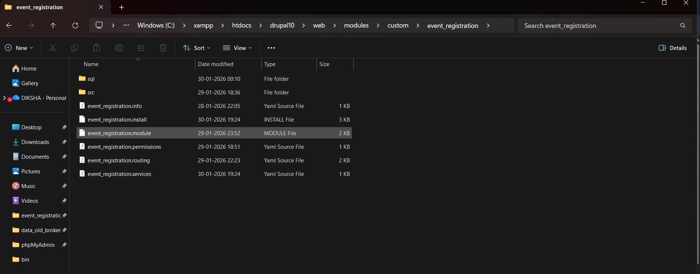
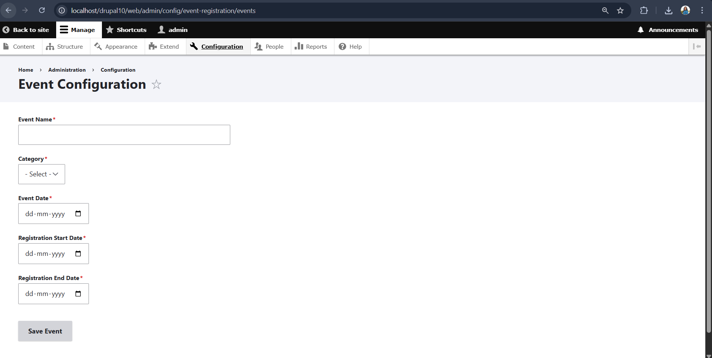
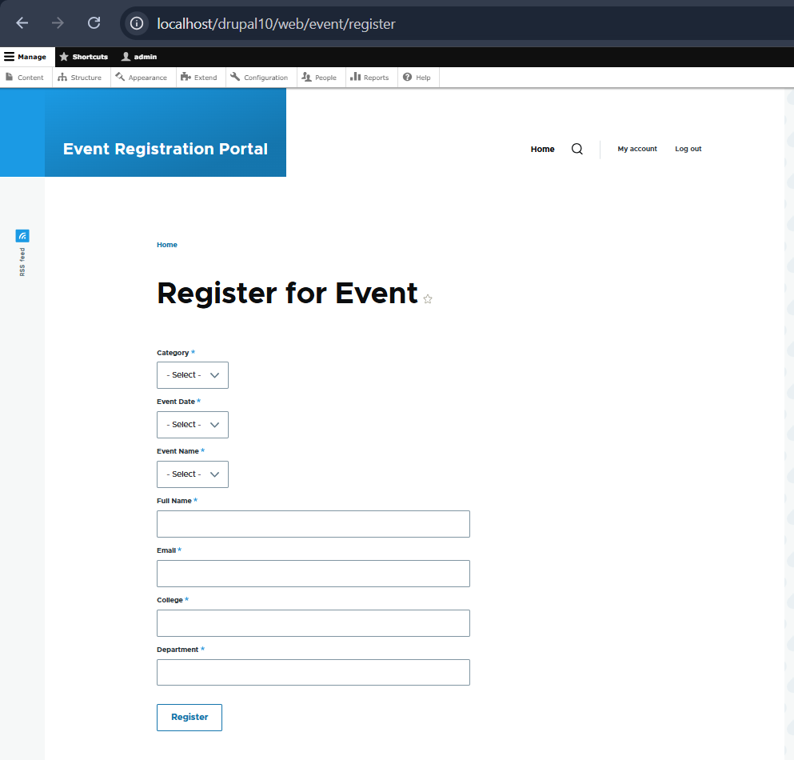
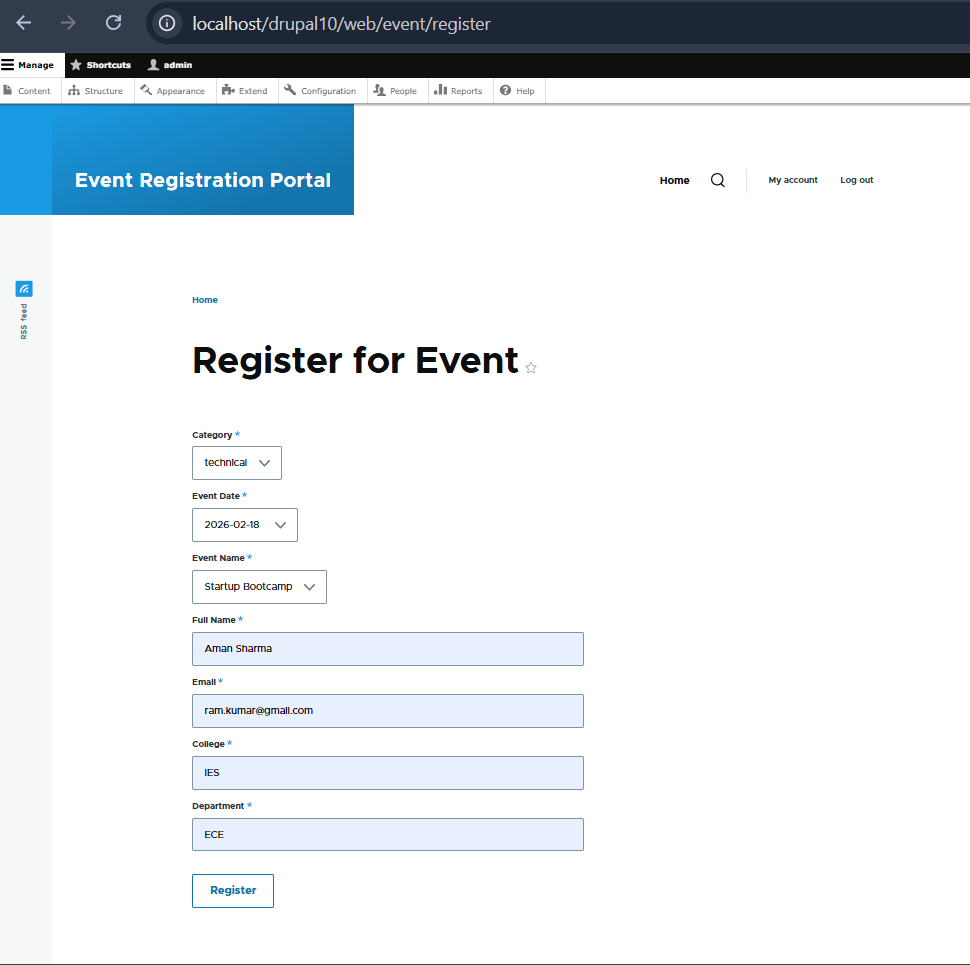
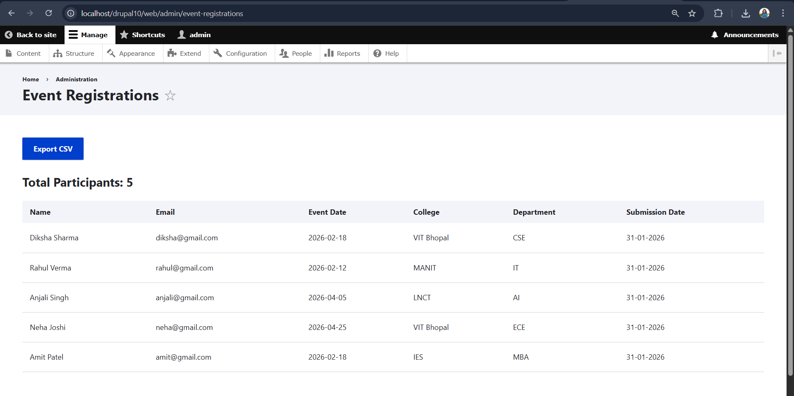
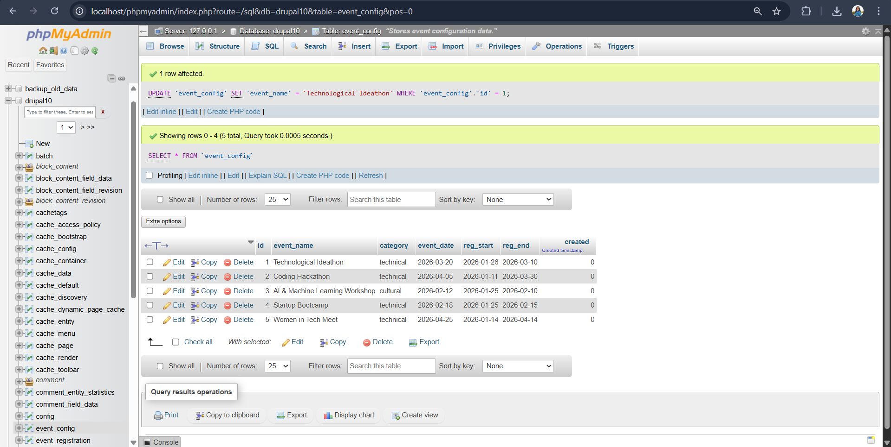

# Event Registration Module (Drupal 10)

A custom Drupal 10 module that allows administrators to configure events and users to register for them through a dynamic registration form. The module stores registrations in custom database tables and supports admin listing, CSV export, and configurable email notifications using Drupal Mail API.

---

## 🚀 Features Overview

* Custom Event Configuration page for administrators
* Dynamic Event Registration Form with AJAX callbacks
* Strong validation (duplicate prevention, input validation)
* Custom database tables (no nodes, no contrib modules)
* Email notifications using Drupal Mail API
* Admin listing of registrations with filters
* CSV export of registration data
* Custom permissions for admin access

---

## 🛠️ Technical Stack

* **Drupal Version:** 10.x
* **PHP Version:** 8.x
* **Database:** MySQL
* **Contributed Modules:** None
* **Architecture:** PSR-4 compliant, Dependency Injection used
* **Coding Standards:** Drupal Coding Standards followed

---

## 📁 Module Structure

```text
drupal-event-registration/
├── screenshots
├── composer.json
├── composer.lock
├── README.md
└── web/
    └── modules/
        └── custom/
            └── event_registration/
                ├── event_registration.info.yml
                ├── event_registration.module
                ├── event_registration.install
                ├── event_registration.permissions.yml
                ├── event_registration.routing.yml
                ├── event_registration.services.yml
                ├── sql/
                │   └── drupal10.sql
                └── src/
                    ├── Form/
                    |   ├── AdminListingFilterForm.php
                    |   ├── AdminSettingForm.php
                    │   ├── EventConfigForm.php
                    │   └── EventRegistrationForm.php
                    ├── Controller/
                    │   └── AdminListingController.php
                    ├── Repository/
                    │   └── EventRepository.php
                    ├── Service/
                    │   └── EventMAilService.php
                    └── Mail/
                        └── EventRegistrationMail.php
```

---

## ⚙️ Installation Steps

1. **Clone the repository**

   ```bash
   git clone https://github.com/dikshamitra/drupal-event-registration.git
   ```

2. **Place the module**

   ```text
   web/modules/custom/event_registration
   ```

3. **Import database tables**
   Import the SQL file:

   ```text
   web/modules/custom/event_registration/sql/drupal10.sql
   ```

4. **Enable the module**

   ```bash
   drush en event_registration
   ```

5. **Clear cache**

   ```bash
   drush cr
   ```

---

## 🔗 Important URLs

### Admin Pages

* Event Configuration
  `/admin/config/event-registration`

* Email Configuration
  `/admin/config/event-registration/email`

* Registration Listing
  `/admin/events/registrations`

* Export Registrations (CSV)
  `/admin/events/registrations/export`

### User Page

* Event Registration Form
  `/events/register`

---

## 🧩 Event Configuration (Admin)

Admins can configure events with the following fields:

* Event Name
* Category (Online Workshop, Hackathon, Conference, One-day Workshop)
* Event Date
* Registration Start Date
* Registration End Date

Stored in database table:

`event_registration_event`

---

## 📝 Event Registration Form (User)

The registration form is available only between the configured registration start and end dates.

### Fields

* Full Name
* Email Address
* College Name
* Department
* Event Category (AJAX)
* Event Date (AJAX)
* Event Name (AJAX)

### AJAX Behavior

* Event dates load based on selected category
* Event names load based on selected category and date

---

## ✅ Validation Rules

* Duplicate registration prevention using **Email + Event**

### Validations

* Proper email format
* No special characters in text fields
* User-friendly validation messages

---

## 🗄️ Database Tables

### event_registration_event

* id
* event_name
* category
* event_date
* reg_start
* reg_end
* created

### event_registration_signup

* id
* event_id
* full_name
* email
* college
* department
* created

---

## 📧 Email Notifications

Implemented using **Drupal Mail API** and `hook_mail()`.

### Emails Sent

* User confirmation email
* Admin notification email (optional)

### Admin Configuration

* Admin email address
* Enable/disable admin notifications

Configuration stored using Config API:

`event_registration.settings`

---

## 📊 Admin Registration Listing

Accessible only to users with permission:

`View event registrations`

### Features

* Filter by Event Date
* Filter by Event Name
* Participant count display
* CSV export of filtered results

---

## 🔐 Permissions

Custom permission:

* **View event registrations**

Assign via:

`Admin → People → Permissions`

---

## 📸 Project Screenshots

### Module Structure


### Event Configuration (Admin)


### Event Registration Form


### Filled Registration Form


### Admin Registrations Listing


### Database Tables


---

## 👩‍💻 Author & Contact

**Diksha Mitra**

Email: dikshamitra3109@gmail.com
